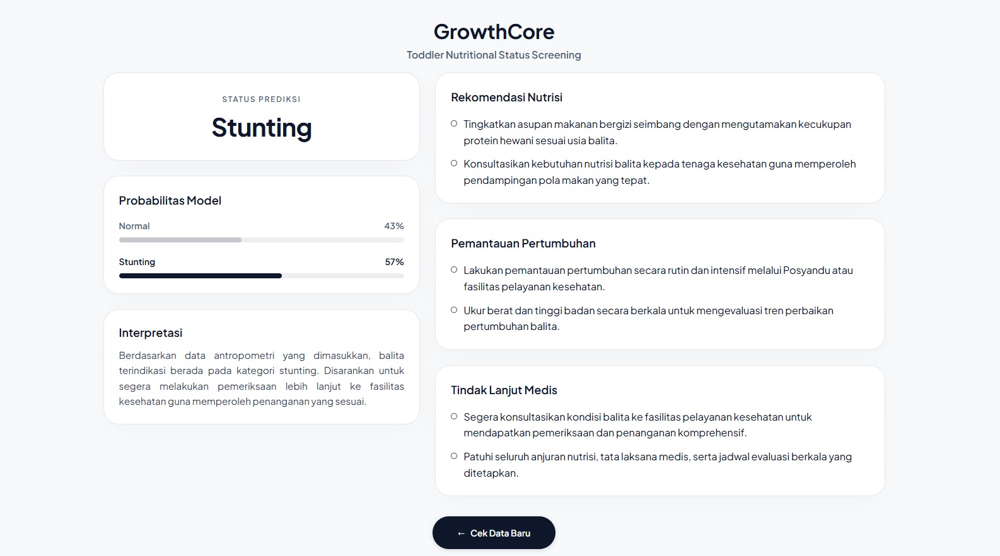
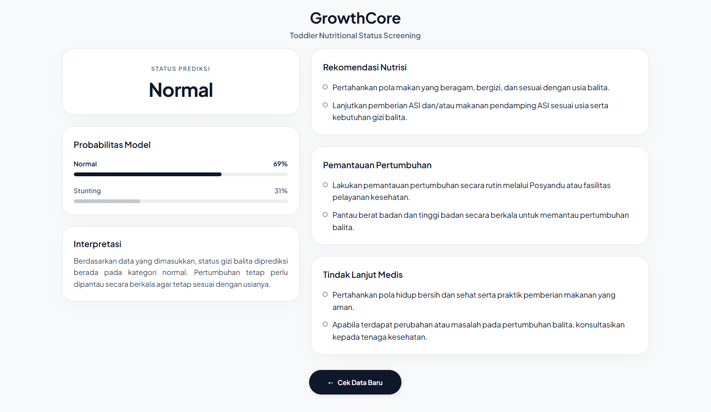

<div align="center">

# GrowthCore: Early Detection of Toddler Nutritional Status (Stunting)

[](https://www.python.org/)
[](https://flask.palletsprojects.com/)
[](https://scikit-learn.org/)
[](#hasil-evaluasi--komparasi-model)
[](LICENSE)

*Implementasi dan komparasi algoritma Random Forest dan K-Nearest Neighbor (KNN) dengan teknik penanganan data tidak seimbang (RUS + SMOTE) berbasis data antropometri Puskesmas, diintegrasikan ke dalam antarmuka skrining berbasis web Flask.*

</div>

---

## Ringkasan Proyek

Stunting pada balita merupakan tantangan kesehatan krusial yang memerlukan deteksi dini secara cepat dan objektif. Proyek ini memadukan siklus komprehensif Machine Learning (AI Project Cycle)—mulai dari akuisisi data antropometri riil, pembersihan dan transformasi data, eksperimen penanganan imbalanced class, optimasi hyperparameter, hingga implementasi produksi (deployment) menggunakan web framework Flask[cite: 1].

---

## Antarmuka Aplikasi Web (GrowthCore)

### 1. Formulir Input Antropometri Balita

<p align="center">
  
</p>

### 2. Hasil Prediksi: Terindikasi Stunting

<p align="center">
  
</p>

### 3. Hasil Prediksi: Pertumbuhan Normal

<p align="center">
  
</p>

---

## Metodologi & Alur Eksperimen

### 1. Dataset & Fitur Terpilih

- Sumber Data: 9.457 rekaman antropometri balita dari fasilitas pelayanan kesehatan Puskesmas di Kabupaten Brebes[cite: 1].
- Tantangan Data: Terjadi ketidakseimbangan kelas pada target klasifikasi (~90.21% Normal vs ~9.79% Stunting)[cite: 1].
- 5 Fitur Antropometri Utama:
  1. Jenis Kelamin (L/P)[cite: 1]
  2. Usia Saat Ukur (Dikonversi ke satuan bulan)[cite: 1]
  3. Berat Badan (kg)[cite: 1]
  4. Tinggi Badan (cm)[cite: 1]
  5. Lingkar Lengan Atas (LiLA) (cm)[cite: 1]
- Target Klasifikasi (Biner):
  - 0 (Normal): Gabungan kategori Normal dan Tinggi[cite: 1]
  - 1 (Stunting): Gabungan kategori Pendek dan Sangat Pendek[cite: 1]

### 2. Pipeline Preprocessing & Resampling

- Pembersihan Data: Imputasi median untuk variabel numerik, modus untuk variabel kategorikal, dan eliminasi data pencilan (outlier)[cite: 1].
- Penanganan Imbalanced Data (Data Training):
  Menguji kombinasi Random Under-Sampling (RUS) dengan variasi rasio (3:1, 2.5:1, 2:1) yang dilanjutkan dengan Regular SMOTE (k=5)[cite: 1]. Skenario RUS 3:1 + Regular SMOTE menghasilkan skor validasi silang tertinggi (Cross-Validation Macro F1: 0.9002)[cite: 1].
- Validasi Model: Stratified 5-Fold Cross Validation untuk menjaga proporsi kelas saat pencarian hyperparameter[cite: 1].

---

## Hasil Evaluasi & Komparasi Model

Evaluasi performa akhir dilakukan secara objektif pada 1.891 data testing independen (tanpa melalui proses resampling)[cite: 1]:


| Metrik Pengujian    | Random Forest (Model Terpilih) | K-Nearest Neighbor (K=3) |
| :------------------ | :----------------------------: | :----------------------: |
| Accuracy            |             98.89%             |          96.19%          |
| Precision Macro     |             96.15%             |          86.35%          |
| Recall Macro        |             97.70%             |          96.44%          |
| F1-Score Macro      |             96.91%             |          90.55%          |
| AUC-ROC             |             0.9942             |          0.7780          |
| True Positive (TP)  |              178              |           179           |
| True Negative (TN)  |             1.692             |          1.640          |
| False Positive (FP) |               14               |            66            |
| False Negative (FN) |               7               |            6            |

Random Forest membuktikan performa lebih baik di seluruh metrik evaluasi serta mampu menekan angka False Positive secara signifikan (14 kasus berbanding 66 kasus pada KNN)[cite: 1]. Model Random Forest ini diekspor ke format serialisasi .pkl sebagai mesin inferensi utama backend web.

---

## Panduan Penggunaan Aplikasi (User Manual)

Antarmuka web Flask dirancang untuk memproses input antropometri secara terstruktur:

1. Akses Sistem: Jalankan server lokal dan buka peramban di http://127.0.0.1:5000. Halaman formulir skrining awal akan langsung ditampilkan.
2. Pengisian Informasi Balita:
   - Jenis Kelamin: Tentukan opsi jenis kelamin balita (Laki-laki / Perempuan).
   - Usia (Bulan): Masukkan usia balita saat pengukuran dalam rentang 0 sampai 59 bulan[cite: 1].
3. Pengisian Parameter Pengukuran Fisik:
   - Berat Badan (kg): Masukkan hasil penimbangan berat badan balita terkini.
   - Tinggi / Panjang Badan (cm): Masukkan hasil pengukuran tinggi atau panjang badan balita.
   - Lingkar Lengan Atas (LiLA): Masukkan ukuran LiLA balita dalam satuan cm.
4. Eksekusi Klasifikasi: Klik tombol Prediksi status. Sistem memvalidasi rentang nilai masukan, menjalankan pra-pemrosesan fitur, dan memanggil model inferensi.
5. Penafsiran Status Gizi: Sistem menampilkan kelas status gizi hasil prediksi:
   - Normal: Indikasi pertumbuhan balita berada dalam batas wajar.
   - Stunting: Indikasi balita memerlukan perhatian dan tindak lanjut tumbuh kembang.
6. Rekomendasi Edukatif Otomatis: Aplikasi menyajikan rekomendasi pendukung berdasarkan pedoman kesehatan pada 3 area:
   - Nutrisi: Pola makan bergizi seimbang dan pemenuhan protein hewani sesuai usia[cite: 1].
   - Pemantauan Pertumbuhan: Pengukuran berkala melalui Posyandu atau fasilitas kesehatan.
   - Tindak Lanjut: Imunisasi lengkap, perilaku hidup bersih dan sehat (PHBS), serta rujukan konsultasi ke tenaga medis jika terindikasi stunting.
7. Pembersihan Data Form: Klik tombol Reset form untuk mengosongkan seluruh kolom masukan sebelum memeriksa data balita berikutnya.

---

## Arsitektur Direktori Proyek

```text
stunting-app/
├── config/                  # Konfigurasi aplikasi & opsi dropdown
│   └── settings.py
├── data/                    # Template dan contoh data uji
├── models/                  # File serialisasi model ML final (.pkl)
│   └── model_random_forest_stunting.pkl
├── notebooks/               # Riset eksperimen Google Colab
│   └── Status_Gizi_Balita.ipynb
├── static/                  # File statis
│   ├── css/style.css
│   └── img/
│       ├── preview-input.png
│       ├── preview-stunting.png
│       └── preview-normal.png
├── templates/               # UI template Jinja2 Flask
│   ├── index.html
│   └── result.html
├── utils/                   # Modular pipeline logika ML & bisnis
│   ├── predictor.py         # Inferensi model
│   ├── preprocessing.py     # Transformasi input form
│   ├── recommendation.py    # Logika edukasi gizi balita
│   └── validators.py        # Validasi batas input pengguna
├── .gitignore               # Aturan pengecualian file sensitif / data lokal
├── app.py                   # Entry point server Flask
├── README.md                # Dokumentasi repositori
└── requirements.txt         # Daftar pustaka dependensi Python
```
